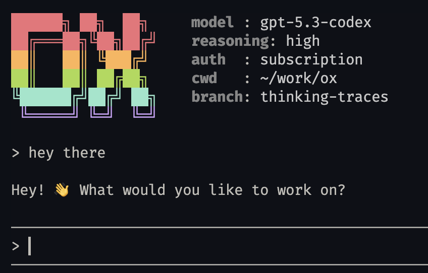

# ox

[](https://github.com/muneebshahid/ox/actions/workflows/ci.yml)
[](LICENSE)



A minimal CLI coding agent in Rust. It connects to OpenAI's Responses API with streaming, provides an interactive REPL, and executes tools autonomously in an agent loop.

## Project Status

Early-stage and evolving quickly. The core loop and TUI are usable, but APIs and internals may change between releases.

## Prerequisites

- Rust `1.87+` (edition 2024)
- `cargo`
- Optional tooling used by built-in tools:
  - `rg` (ripgrep) for fast content search
  - `fd` for fast file discovery

If `rg` or `fd` are missing, `ox` falls back to `grep` and `find`.

## Quickstart

```bash
git clone https://github.com/muneebshahid/ox.git
cd ox
cp .env.example .env
cargo run
```

## Configuration

Choose one auth mode via `AUTH_MODE` in `.env`.

### API key mode (`AUTH_MODE=api`)

Use the OpenAI API directly (`https://api.openai.com/v1/responses`):

```text
AUTH_MODE=api
OPENAI_API_KEY=sk-...
# optional override; default in api mode is gpt-4.1-mini
OPENAI_MODEL=gpt-4.1-mini
# reasoning effort:
# off|none|minimal|low|medium|high|xhigh
# if unset or invalid, defaults to medium
OPENAI_REASONING=medium
```

### Subscription mode (`AUTH_MODE=subscription`)

Use Codex/ChatGPT auth tokens (`https://chatgpt.com/backend-api/codex/responses`):

```bash
codex login
```

```text
AUTH_MODE=subscription
# optional override; default in subscription mode is gpt-5.3-codex
OPENAI_MODEL=gpt-5.3-codex
# reasoning effort:
# off|none|minimal|low|medium|high|xhigh
# if unset or invalid, defaults to medium
OPENAI_REASONING=high
```

Token loading behavior:

- Loads `CODEX_HOME/auth.json` when `CODEX_HOME` is set.
- Otherwise loads `~/.codex/auth.json`.
- If the subscription access token is expired, `ox` refreshes it and writes updated tokens back to the same file.

## Usage

```bash
cargo run
```

```text
> read src/main.rs and explain what it does
Calling read_file...
The main entry point sets up a REPL loop that...

> find all rust files and count the lines
Calling find...
Calling bash...
There are 250 lines across 9 Rust files.

> exit
```

CLI flags:

```text
ox [--session <name>] [--list-sessions]
```

## Built-in Tools

| Tool         | Description                                                 |
| ------------ | ----------------------------------------------------------- |
| `read_file`  | Read file contents                                          |
| `write_file` | Create or overwrite files                                   |
| `edit`       | Search-and-replace edit (old_text must be unique)           |
| `ls`         | List directory contents                                     |
| `grep`       | Search file contents with `rg` (falls back to `grep`)       |
| `find`       | Find files by glob pattern with `fd` (falls back to `find`) |
| `bash`       | Execute shell commands                                      |

## Architecture Overview

Top-level responsibilities are split into focused modules:

- `src/agent`: streaming responses, event processing, and agent loop behavior
- `src/tui`: terminal UI state, rendering, and orchestration
- `src/events`: event types, hub, and bridge wiring
- `src/tools`: tool implementations exposed to the model (`read_file`, `bash`, etc.)
- `src/auth`: API key/subscription auth and token storage behavior
- `src/session`: session naming, persistence, and lifecycle management

## Development

```bash
cargo fmt
cargo clippy --all-targets --all-features -- -D warnings
cargo test --all-targets --all-features
```

## Security Notes

`ox` includes a `bash` tool that can execute arbitrary shell commands as part of the agent loop. Run it only in trusted repositories and isolated environments.

If you find a vulnerability, see [`SECURITY.md`](SECURITY.md).

## Contributing

Contributions are welcome. Start with [`CONTRIBUTING.md`](CONTRIBUTING.md) and follow the [`CODE_OF_CONDUCT.md`](CODE_OF_CONDUCT.md).

## License

This project is licensed under the MIT License. See [`LICENSE`](LICENSE).

## Roadmap

- Stabilize module boundaries across `agent`, `events`, and `tui`
- Add architecture docs for session/event ownership
- Improve test coverage for end-to-end streaming and tool orchestration
- Prepare first tagged release (`v0.1.0`)
