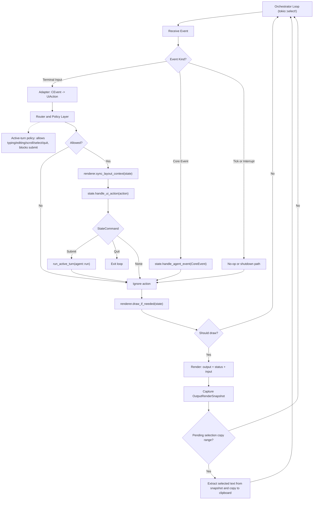

# TUI Event Flow

```mermaid
flowchart TD
    A["Orchestrator Loop (tokio::select!)"] --> B["Receive Event"]
    B --> C{"Event Kind?"}

    C -->|Terminal Input| D["Adapter: CEvent -> UiAction"]
    C -->|Core Event| E["state.handle_agent_event(CoreEvent)"]
    C -->|Tick or Interrupt| F["No-op or shutdown path"]

    D --> G["Router and Policy Layer"]
    G -.-> G1["Active-turn policy: allows typing/editing/scroll/select/quit, blocks submit"]
    G --> H{"Allowed?"}
    H -->|No| M["Ignore action"]
    H -->|Yes| I["renderer.sync_layout_context(state)"]
    I --> J["state.handle_ui_action(action)"]
    J --> K{"StateCommand"}
    K -->|Submit| L["run_active_turn(agent::run)"]
    K -->|Quit| Z["Exit loop"]
    K -->|None| M

    E --> M
    F --> M
    L --> M

    M --> N["renderer.draw_if_needed(state)"]
    N --> O{"Should draw?"}
    O -->|No| A
    O -->|Yes| P["Render: output + status + input"]
    P --> Q["Capture OutputRenderSnapshot"]
    Q --> R{"Pending selection copy range?"}
    R -->|Yes| S["Extract selected text from snapshot and copy to clipboard"]
    R -->|No| A
    S --> A
```
