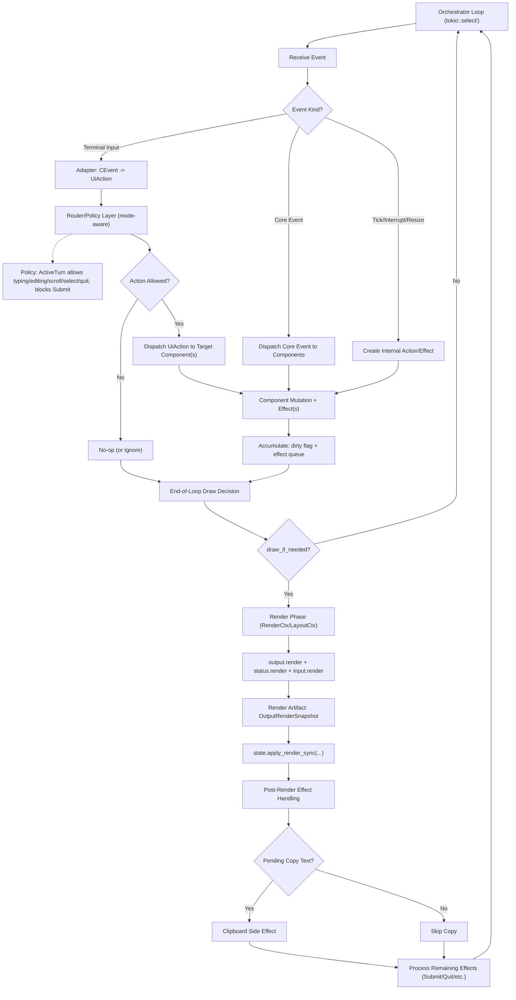

# TUI Event Flow

```mermaid
flowchart TD
    A["Orchestrator Loop (tokio::select!)"] --> B["Receive Event"]
    B --> C{"Event Kind?"}

    C -->|Terminal Input| D["Adapter: CEvent -> UiAction"]
    C -->|Core Event| E["Dispatch Core Event to Components"]
    C -->|Tick/Interrupt/Resize| F["Create Internal Action/Effect"]

    D --> G["Router/Policy Layer (mode-aware)"]
    G -.-> G1["Policy: ActiveTurn allows typing/editing/scroll/select/quit, blocks Submit"]
    G --> H{"Action Allowed?"}
    H -->|No| I["No-op (or Ignore)"]
    H -->|Yes| J["Dispatch UiAction to Target Component(s)"]

    E --> K["Component Mutation + Effect(s)"]
    F --> K
    J --> K
    I --> M["End-of-Loop Draw Decision"]

    K --> L["Accumulate: dirty flag + effect queue"]
    L --> M

    M --> N{"draw_if_needed?"}
    N -->|No| A
    N -->|Yes| O["Render Phase (RenderCtx/LayoutCtx)"]

    O --> P["output.render + status.render + input.render"]
    P --> Q["Render Artifact: OutputRenderSnapshot"]
    Q --> R["state.apply_render_sync(...)"]

    R --> S["Post-Render Effect Handling"]
    S --> T{"Pending Copy Text?"}
    T -->|Yes| U["Clipboard Side Effect"]
    T -->|No| V["Skip Copy"]

    U --> W["Process Remaining Effects (Submit/Quit/etc.)"]
    V --> W
    W --> A
```
