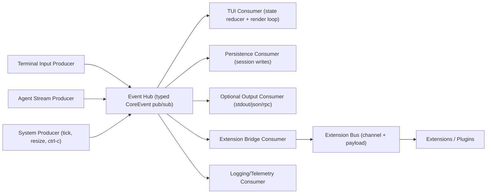

# Event-First Re-Architecture Plan (TUI + Future Consumers)

This file is the working guide for rebuilding interaction around a shared event model.
The TUI is one consumer, not the only consumer.

## 1) Current issues to solve

1. Input freezes while agent output is streaming.
- Root cause: blocking input path and async work are coupled.

2. Scroll and key handling feel laggy under streaming load.
- Root cause: redraws are triggered too often and expensive calculations happen too frequently.

3. Rendering ownership is unclear.
- Root cause: multiple code paths can affect terminal output.

4. State and rendering are tightly coupled.
- Root cause: difficult debugging and harder incremental changes.

5. Interactive guarantees are weakly tested.
- Root cause: limited reducer/event-sequence tests.

## 2) Target architecture (generic)

- One typed core event model (`CoreEvent`) for app lifecycle, stream deltas, tools, and UI input.
- One event hub for pub/sub fan-out to many consumers.
- Independent producers emit events into the hub.
- Independent consumers subscribe and react:
- TUI renderer
- Optional stdout renderer
- Session persistence
- Extension runtime/hooks
- Telemetry/logging

The main loop should orchestrate tasks, not own rendering logic.

## 3) Architecture diagram



## 4) High-level connection model

1. Producers only emit events.
- Input task emits `Input*` events.
- Agent bridge emits `Agent*` and `Tool*` events.
- Runtime task emits `Tick`, `ShutdownRequested`, etc.

2. Event hub routes events to all subscribers.
- Each subscriber receives the same typed event stream.
- Subscribers are isolated; one slow consumer must not block others.

3. Consumers decide behavior.
- TUI updates `AppState` and renders.
- Persistence listens for commit points and writes session entries.
- Extensions listen through a bridge that maps `CoreEvent` to extension-facing events.

4. Extension bus is separate from core lifecycle stream.
- Core lifecycle stays typed and stable.
- Extension bus supports custom channels and payloads for plugin-to-plugin communication.

## 5) Event model guidelines

- Prefer typed Rust enums for core events.
- Keep event payloads minimal but sufficient.
- Avoid opaque `String` event types for core internals.
- Use custom channel events only at extension boundary.

Example shape (illustrative):

```rust
enum CoreEvent {
    InputKey(KeyEvent),
    InputPaste(String),
    UiResize { width: u16, height: u16 },
    Tick,
    AgentTurnStart,
    AgentTextDelta(String),
    AgentTurnEnd,
    ToolStart { id: String, name: String, args: serde_json::Value },
    ToolUpdate { id: String, partial: serde_json::Value },
    ToolEnd { id: String, result: serde_json::Value, is_error: bool },
    Error(String),
    ShutdownRequested,
}
```

## 6) Incremental plan (teach-first, small steps)

## Step 0: Core event contract + hub only

Goal:
- Create shared architecture before any TUI details.

Deliverables:
- `src/events/types.rs` with `CoreEvent`.
- `src/events/hub.rs` with subscribe + publish API.
- Unit tests for fan-out behavior and shutdown semantics.

Done criteria:
- Minimal example emits events and two test subscribers both receive them.

## Step 1: Agent bridge emits events

Goal:
- Decouple stream consumption from rendering.

Deliverables:
- `src/events/agent_bridge.rs` that maps stream deltas/tool lifecycle to `CoreEvent`.
- No TUI yet.

Done criteria:
- Existing run path can emit events while processing agent stream.

## Step 2: Add simple non-TUI consumer (debug/stdout)

Goal:
- Prove architecture is generic.

Deliverables:
- A consumer that logs structured events.

Done criteria:
- Running a prompt shows event flow without TUI.

## Step 3: Introduce TUI as one subscriber

Goal:
- TUI consumes events; does not own event production.

Deliverables:
- `src/tui/mod.rs`, `state.rs`, `render.rs`, `input.rs`.
- Single-owner reducer + render loop.

Done criteria:
- Input remains responsive while agent is streaming.

## Step 4: Redraw policy and scroll model

Goal:
- Remove lag and preserve responsiveness.

Deliverables:
- Dirty-flag redraw policy with capped FPS.
- `follow_output` and manual scroll mode with clear transitions.

Done criteria:
- Smooth scroll during active stream on release build.

## Step 5: Persistence subscriber

Goal:
- Preserve session guarantees through events.

Deliverables:
- Consumer that writes user/assistant/tool data on well-defined commit events.

Done criteria:
- Session replay remains correct.

## Step 6: Extension bridge foundation

Goal:
- Prepare for plugin ecosystem.

Deliverables:
- Map selected `CoreEvent` into extension-facing events.
- Add custom extension bus (`channel + payload`) for inter-extension messages.

Done criteria:
- Extension hooks can react without touching TUI code.

## Step 7: Architecture-level tests

Goal:
- Lock in guarantees.

Deliverables:
- Reducer tests, hub tests, and integration tests for:
- input during stream
- scroll while streaming
- no output starvation under tool updates

Done criteria:
- Regressions are caught without manual terminal verification.

## 7) Proposed module layout

- `src/events/mod.rs` (exports)
- `src/events/types.rs` (`CoreEvent`)
- `src/events/hub.rs` (pub/sub router)
- `src/events/agent_bridge.rs` (agent stream -> events)
- `src/events/extension_bridge.rs` (core -> extension events)
- `src/tui/mod.rs` (runtime wiring)
- `src/tui/state.rs` (TUI reducer)
- `src/tui/render.rs` (draw-only code)
- `src/tui/input.rs` (terminal input producer)
- `src/tui/text_metrics.rs` (wrapping/scroll math)

## 8) Collaboration protocol (you lead)

For each step:

1. Explain the concept first (plain language).
2. Agree exact scope for the step.
3. Implement only that scope.
4. Run lint/tests.
5. Summarize what changed and why.
6. Wait for your sign-off before next step.

## 9) Start point

Start with Step 0 only: define `CoreEvent` and the event hub, plus tests.
